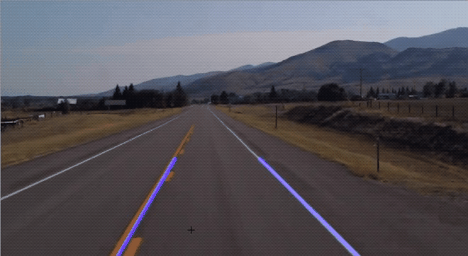

# computer_vision_lane_detection
# Finding Lanes for Self Driving Car
This is a self-learning hands-on project related to find guiding lanes for a self-driving car.  

 

Below are the highlighted steps for the procedure:

# Step 1
Import image and convert to an array

# Step 2
Canny edge detection - identyfying sharp changes in intensity in adjacent pixels.

Notes : image can be read as matrix or an array of pixelsin which 0 = min intensity and 255 = max intensity.

Change pic to gray scale.

# Step 3
Gaussian Blur - reduce image noise by averaging out the pixels with a kernel

Kernel - sets each pixel values equal to weighted average of its neighbouring pixels

# Step 4
Apply canny edge detection by computing the derivative in all directions of the image, we are computing the gradients since the gradient is the change in birghtness over a series of pixels

If the value is lower than threshold, reject, higher than threhold indicate as an edge, between lower and upper threshold - treated as edge only if it is connected to a strong edge

Lower threshold : Higher threshold normally use 1:2 or 1:3 ratio

# Step 5
Finding the area of interest (video at 22.54).

Use matplotlib to first see the coordinate of area of interest.

# Step 6 taking bitwise end!
Apply the black mask to the canny image. We use bitwise '&' operation between two images since both images have the same array shape and therefore the same dimension and the same amount of pixels.

0000 & 0101 will always be 0000

1111 & 0101 will be  0101 same as the input - binary numbers video at 30.41

# Step 7 Hough Transform
Theory - first draw the 2d corrdinate space of x and y and inside it is a straight line y = mx + b.

In hough space, the x axis is m and y axis is b. Video at 42.00, notice that a single point in x and y space is represented 
by a line in Hough space. In other words, by plotting the family of lines that goes through our points each line with its own distinct M and B value pair, this produces an entire line of M and B value pairs in Hough space.

The intersection point in hough space represents there is a line to cross two points as in x and y plane. 

But there is not always straight line, hence -> we split hough space into grid, inside of grid corresponding to the slope
and y- intercept of candidate line.

Then, We will notice that some points of intersection are inside a single bin and need to cast the votes inside of the bin that it belongs to the bin.

The bin with the maximum number of votes, that gonna be the best fit in describing our data now. 

BUT imagine if there is a vertical line, we have infinity gradient y = mx + b cannot be represented. Hence, we would better represent parameters in the polar coordinate system rather than cartesian coordinate sys. 

rho = x cos theta + y sin theta

now the x axis in hough space is theta (radians) and y axis is rho (p) and it is sinusoidal. 

# Step 8 Hough Transform 2 - Implementation
*Hough accumulator array is previously described as a grid for simplicity
and it is actually a two dimensional array of rows and columns to use to collect votes
 video at 52.15.

Size of the bins - rho is the distance resolution of accumulator in pixels
angle is the angle resolution of the accumulator in radians. 

The smaller the row and degree intervals we specify for each bin, the smaller the bins, 
the more precision in which we can detect our lines. Of course, dont make it too
small as it will result in inaccuracies and takes a longer time to run.

* 4th argument - threshold is the minimum number of votes needed to accept a candidate line
* 5th argument = placeholder array which we need to pass in, just empty array
* 6th - length of a line in pixels that we will accept into the output
*maxLineGap - this indicates the max distance in pixels between segmented lines
		which we will allow to be connected into a single line instead of them being broken up. 

addWeighted() - take the sum of our color image with our line image.
		- background of line image is black since that would signify pixel intensities
			 	of 0, by adding 0 with the pixel intensities of ori image, the pixel
			 	intensities of ori image would just stay the same.

# Step 9 - Optimization finding lane lines
Instead of having multiple lines, we can average their slope and y-intercept
into a single line that traces out both of lanes.

We use polyfit as it will fit a first degree polynomial which would simply be a
linear function of y = mx + b and return a vector of coefficients that are gradient and y-intercept.

We know that the slope of the left side is -ve, while the right side is +ve
   slope +ve when x and y increases refer video at 1.09.09

We then take the coordinate of each line and plot on the original lane image (video at 1:14:14)

Why 3/5 because we just goes three-fifths of the way upwards from bottom of screen

Rmb to change the function display_lines as "lines" is now 2d array

# Step 10- Finding lanes in videos

